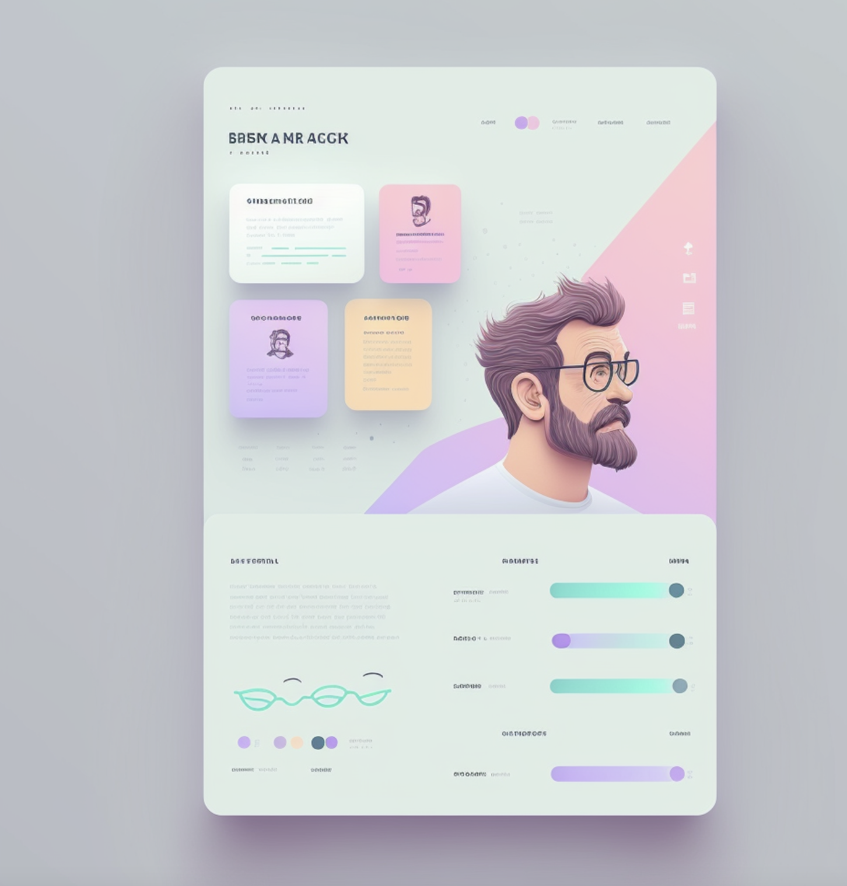

# 🚀Data Science & Analytics Portfolio 

## 👋Welcome to my Data Science Journey!

## Technologies Used🛠️

- **HTML5:** For structuring the content of the website
- **CSS3:** For styling and layout, including custom animations
- **JavaScript:** For interactive elements and dynamic content loading
- **Bootstrap:** For responsive design and pre-built components
- **Font Awesome:** For icons
- **Google Fonts:** For typography

## 🏗️ Project Structure

personal-portfolio/
│
├── assets/
│   ├── css/
│   │   └── style.css
│   ├── js/
│   │   └── main.js
│   ├── img/
│   │   └── (project images)
│   └── vendor/
│       ├── bootstrap/
│       ├── jquery/
│       └── ...
│
├── index.html
├── project-details.html
└── README.md

## 🔑 Key Features

1. **Responsive Design:** Utilizing Bootstrap grid system for a mobile-first approach
2. **Dynamic Project Showcase:** JavaScript-powered project gallery with filtering options
3. **Interactive Elements:** Smooth scrolling, animated progress bars, and hover effects
4. **Optimized Images:** Compressed and properly sized images for faster loading
5. **Cross-Browser Compatibility:** Tested on major browsers for consistent experience

## 💡 Implementation Highlights

- **Custom CSS Animations:** Created smooth transitions and hover effects for enhanced user experience
- **SEO Optimization:** Implemented proper meta tags and semantic HTML structure
- **Performance Tuning:** Minified CSS and JavaScript, leveraged browser caching
- **Accessibility:** Ensured proper contrast ratios and semantic HTML for screen readers
- **Project Detail Pages:** Dynamically generated pages for each project using JavaScript templates

## 🚀 Deployment

The website is deployed using GitHub Pages, providing a seamless integration with the repository for easy updates and maintenance.

## Live Demo 🌐
Experience the live version of the portfolio: <a href="https://stephaniegessler.github.io/" target="_blank">View Portfolio</a>

## 🤝 Contributing

While this is a personal project, suggestions and feedback are always welcome. Feel free to open an issue or submit a pull request.

<!-- ALL-CONTRIBUTORS-LIST:START - Do not remove or modify this section -->
<!-- prettier-ignore-start -->
<!-- markdownlint-disable -->
<table>
  <tr>
    <td align="center"><a href="https://github.com/steguess"> <b>Stephanie Gessler</b></a> <a href="https://github.com/codesandbox/codesandbox-client/commits?author=steguess" title="Frontend Developer">💻</a></td>
</table>
